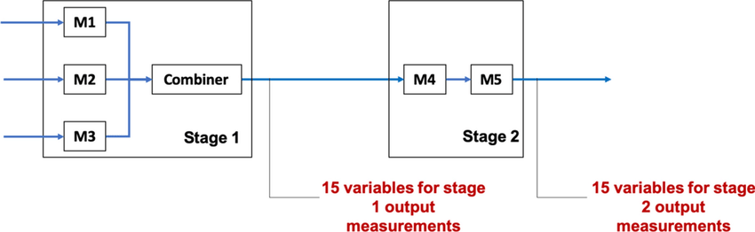

```{r setup, include=FALSE}
knitr::opts_chunk$set(echo = TRUE)
```

<br>
<br>
<br>

## [데이터 분석 개요]
### 1. 대상 데이터: 다단계 공정 데이터셋
(https://www.kaggle.com/datasets/supergus/multistage-continuousflow-manufacturing-process)

미시간 주 디트로이트 근처의 실제 생산 라인 내에서 여러 위치, 여러 생산 라인에 대하여 계측한 데이터

다양한 입력 데이터로부터 라인의 출력 특정 속성을 예측하기 위한 목적으로 수집

해당 공정 라인은 병렬 및 직렬 단계로 구성된 고속 연속 제조 공정으로, 다음과 같은 구조를 가짐

* Stage 1에서는 M1, M2, M3 기계가 병렬로 작동하며, 이들의 출력이 결합기로 전달

* 결합기에서 출력되는 Stage 1에 대한 예측치는 제작된 제품의 외부 표면을 둘러싼 15개의 위치에서 측정

* 다음으로, M4와 M5가 직렬로 처리하는 Stage 2로 이동

* M5 작동 후에는 동일한 15개의 위치에 대한 Stage 2의 측정이 이루어짐

<br>



<br>
* Oleghe, O. (2020). A predictive noise correction methodology for manufacturing process datasets. Journal of Big Data, 7(1), 89.

<br>
<br>
<br>

### 2. 분석 절차

데이터 탐색 및 전처리 / 특징 추출 및 차원 축소 / 모델 학습 및 평가 순서로 3단계로 나누어 분석 진행

2단계 공정인 관계로 Stage 1에 대한 예측모델, Stage 2에 대한 예측모델을 2단계로 모델링할 것 (이 때, Stage 2의 결과는 Stage 1에 영향을 받음)

원래 Stage 1, Stage 2에 대한 예측값은 각각 15개씩이지만, 본 강의에서는 다변량 예측을 다루지 않는 관계로 각 Stage에 대한 평균값을 종속변수로 설정

팀별로 작업을 수행하며, 작업 코드는 팀장의 Github에 Push하여 공유, 통찰력 있는 분석 기법 발굴 시 모두와 공유

가이드로 제공된 참고문헌을 바탕으로 다양한 방법론으로 분석을 수행

<br>
<br>
<br>

## [데이터 분석]
### 1. 데이터 탐색 및 전처리

* 데이터의 전반적인 분포, 특징을 파악하기 위한 기초 분석 진행

* 다양한 전처리 방법론을 활용하여 데이터를 정제
(e.g. 필요없는 변수 및 이상치/노이즈 제거 또는 보정, 표준화 등)

* 데이터 전처리 순서 (학습, 테스트셋 분할 전후)를 꼼꼼히 살펴보고 진행할 것

```{r preprocess}
dat <- read.csv("산업공학특론I_13-14주차_데이터.csv")
head(dat)

# 각 컬럼에서 벗어나는 값들을 NA로 대체
for(i in 0:14) {
  actual_col <- paste0("Stage1.Output.Measurement", i, ".U.Actual")
  setpoint_col <- paste0("Stage1.Output.Measurement", i, ".U.Setpoint")
  
  mean_act <- mean(dat[[actual_col]], na.rm = TRUE)
  sd_act <- sd(dat[[actual_col]], na.rm = TRUE)
  
  mean_set <- mean(dat[[setpoint_col]], na.rm = TRUE)
  sd_set <- sd(dat[[setpoint_col]], na.rm = TRUE)
  
  # 노이즈 범위 계산
  lower_bound <- mean_act - threshold * sd_act
  upper_bound <- mean_act + threshold * sd_act
  lower <- mean_set - threshold * sd_set
  upper <- mean_set + threshold * sd_set
  
  # 범위를 벗어나는 값들을 NA로 대체
  dat[[actual_col]][dat[[actual_col]] < lower_bound | dat[[actual_col]] > upper_bound] <- NA
  dat[[setpoint_col]][dat[[setpoint_col]] < lower | dat[[setpoint_col]] > upper] <- NA
}

# NA 값을 중앙값으로 대체하는 함수
replace_na_with_median <- function(x) {
  x[is.na(x)] <- median(x, na.rm = TRUE)
  return(x)
}

# 각 컬럼에 대해 NA 값을 중앙값으로 대체
for(i in 0:14) {
  actual <- paste0("Stage1.Output.Measurement", i, ".U.Actual")
  setpoint <- paste0("Stage1.Output.Measurement", i, ".U.Setpoint")
  dat[[actual]] <- replace_na_with_median(dat[[actual]])
  dat[[setpoint]] <- replace_na_with_median(dat[[setpoint]])
}

par(mar = c(2, 2, 2, 2))
par(mfrow = c(5, 3))
for(i in 0:14) {
  acol <- paste0("Stage1.Output.Measurement", i, ".U.Actual")
  scol <- paste0("Stage1.Output.Measurement", i, ".U.Setpoint")
  plot(dat[[acol]], col = "blue", ylab = "Measurements", xlab = "Index",
       main = paste("Actual vs Setpoint - Measurement", i))
  points(dat[[scol]], col = "red")
  legend("topright", legend = c("Actual", "Setpoint"), col = c("blue", "red"), pch = 1)
}

actcol <- paste0("Stage1.Output.Measurement", 0:14, ".U.Actual")
setcol <- paste0("Stage1.Output.Measurement", 0:14, ".U.Setpoint")
target <- data.frame(Average = rowMeans(dat[, actcol], na.rm = TRUE))
setpoint <- data.frame(Average = rowMeans(dat[, setcol], na.rm = TRUE))
plot(target$Average, col = "blue", ylab = "Measurements", xlab = "Index",
     main = paste("Actual vs Setpoint - Measurement"), ylim=c(0,14))
points(setpoint$Average, col = "red")
legend("topright", legend = c("Actual", "Setpoint"), col = c("blue", "red"), pch = 1)
threshold <- 1

```

<br>

### 2. 특징 추출 및 차원 축소

* 전처리가 이루어진 데이터로부터 특성을 재정의하거나 차원 축소 기법을 적용

* 신규 변수 또는 축소된 차원으로 효과적인 예측을 수행하기 위한 방안 도출

```{r feature}

```

<br>

### 3. 모델 학습 및 평가

* Stage 1, Stage 2에 대한 예측 모델을 수립할 것

* 이 때, 각 Stage는 연결되어 있으며 Stage 2는 Stage 1의 영향을 받음

```{r modeling}

```
