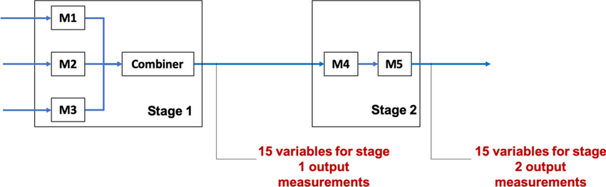

```{r setup, include=FALSE}
knitr::opts_chunk$set(echo = TRUE)
```

<br>
<br>
<br>

## [데이터 분석 개요]
### 1. 대상 데이터: 다단계 공정 데이터셋
(https://www.kaggle.com/datasets/supergus/multistage-continuousflow-manufacturing-process)

미시간 주 디트로이트 근처의 실제 생산 라인 내에서 여러 위치, 여러 생산 라인에 대하여 계측한 데이터

다양한 입력 데이터로부터 라인의 출력 특정 속성을 예측하기 위한 목적으로 수집

해당 공정 라인은 병렬 및 직렬 단계로 구성된 고속 연속 제조 공정으로, 다음과 같은 구조를 가짐

* Stage 1에서는 M1, M2, M3 기계가 병렬로 작동하며, 이들의 출력이 결합기로 전달

* 결합기에서 출력되는 Stage 1에 대한 예측치는 제작된 제품의 외부 표면을 둘러싼 15개의 위치에서 측정

* 다음으로, M4와 M5가 직렬로 처리하는 Stage 2로 이동

* M5 작동 후에는 동일한 15개의 위치에 대한 Stage 2의 측정이 이루어짐

<br>



<br>
* Oleghe, O. (2020). A predictive noise correction methodology for manufacturing process datasets. Journal of Big Data, 7(1), 89.

<br>
<br>
<br>

### 2. 분석 절차

데이터 탐색 및 전처리 / 특징 추출 및 차원 축소 / 모델 학습 및 평가 순서로 3단계로 나누어 분석 진행

2단계 공정인 관계로 Stage 1에 대한 예측모델, Stage 2에 대한 예측모델을 2단계로 모델링할 것 (이 때, Stage 2의 결과는 Stage 1에 영향을 받음)

원래 Stage 1, Stage 2에 대한 예측값은 각각 15개씩이지만, 본 강의에서는 다변량 예측을 다루지 않는 관계로 각 Stage에 대한 평균값을 종속변수로 설정

팀별로 작업을 수행하며, 작업 코드는 팀장의 Github에 Push하여 공유, 통찰력 있는 분석 기법 발굴 시 모두와 공유

가이드로 제공된 참고문헌을 바탕으로 다양한 방법론으로 분석을 수행

<br>
<br>
<br>

## [데이터 분석]
### 1. 데이터 탐색 및 전처리

* 데이터의 전반적인 분포, 특징을 파악하기 위한 기초 분석 진행

* 다양한 전처리 방법론을 활용하여 데이터를 정제
(e.g. 필요없는 변수 및 이상치/노이즈 제거 또는 보정, 표준화 등)

* 데이터 전처리 순서 (학습, 테스트셋 분할 전후)를 꼼꼼히 살펴보고 진행할 것

```{r preprocess}
trainsc1 <- read.csv("train_Stage1.csv"); trainsc2 <- read.csv("train_Stage2.csv")
testsc1 <- read.csv("test_Stage1.csv"); testsc2 <- read.csv("test_Stage2.csv")
```

<br>

### 2. 특징 추출 및 차원 축소

* 전처리가 이루어진 데이터로부터 특성을 재정의하거나 차원 축소 기법을 적용

* 신규 변수 또는 축소된 차원으로 효과적인 예측을 수행하기 위한 방안 도출

```{r sj}
library(pls)
library(caret)
library(Metrics)

err <- function(actual, pred) {
  result <- c(mae(actual, pred), mse(actual, pred), rmse(actual, pred))
  names(result) <- c('MAE', 'MSE', 'RMSE')
  print(result)
}

pcr_model1 <- pcr(trainsc1$Stage1_Output ~ ., data = trainsc1, validation = 'CV')
#주성분검토
par(mfrow=c(1,1))
biplot(pcr_model1); summary(pcr_model1); 

par(mfrow=c(3,1))
plot(RMSEP(pcr_model1), legendpos = "topright")
plot(pcr_model1, ncomp = 12, asp = 1, line = TRUE)
plot(pcr_model1, "loadings", comps = 1:12, legendpos = "topleft")

pc1 <- pcr_model1$scores[,1:12]
reg_pc1 <- lm(trainsc1$Stage1_Output ~ pc1)
summary(reg_pc1)
pred_pcr1 <- predict(pcr_model1, testsc1, ncomp=12)
trainsc2$PCR_Stage1_Pred <- predict(reg_pc1, newdata = trainsc2)
err(testsc2$Stage2_Output, pred_pcr1)

pcr_model2 <- pcr(trainsc2$Stage2_Output ~ ., data = trainsc2, validation = 'CV')
biplot(pcr_model2)
summary(pcr_model2)

par(mfrow=c(3,1))
plot(RMSEP(pcr_model2), legendpos = "topright")
plot(pcr_model2, ncomp = 14, asp = 1, line = TRUE)
plot(pcr_model2, "loadings", comps = 1:14, legendpos = "topleft")

pc2 <- pcr_model1$scores[,1:14]
reg_pc2 <- lm(trainsc2$Stage2_Output ~ pc2)
summary(reg_pc2)
testsc2$PCR_Stage1_Pred <- pred_pcr1
pred_pcr2 <- predict(pcr_model2, testsc2, ncomp=14)
err(testsc2$Stage2_Output, pred_pcr2)

trainsc2 <- trainsc2[ , !(names(trainsc2) %in% "PCR_Stage1_Pred")]

# PLSR
# 모델수립
#plsr_model1 <- plsr(trainsc1$Stage1_Output ~ ., data = trainsc1, validation = 'CV')
#par(mfrow=c(1,1))
#biplot(plsr_model1); summary(plsr_model1)
#par(mfrow=c(3,1))
#plot(RMSEP(plsr_model1), legendpos = "topright")
#plot(plsr_model1, ncomp = 17, asp = 1, line = TRUE)
#plot(plsr_model1, "loadings", comps = 1:17, legendpos = "topleft")
#pred_plsr1 <- predict(plsr_model1, testsc1, ncomp=17)
#trainsc2$PLSR_Stage1_Pred <- predict(plsr_model1, newdata = trainsc2)
#err(testsc2$Stage2_Output, pred_plsr1)

#plsr_model2 <- plsr(trainsc2$Stage2_Output ~ ., data = trainsc2, validation = 'CV')
#잠재변수검토
#biplot(plsr_model2)
#summary(plsr_model2)
#par(mfrow=c(3,1))
#plot(RMSEP(plsr_model2), legendpos = "topright")
#plot(pcr_model2, ncomp = 20, asp = 1, line = TRUE)
#plot(pcr_model2, "loadings", comps = 1:20, legendpos = "topleft")
#testsc2$PLSR_Stage1_Pred <- pred_pcr1
#pred_plsr2 <- predict(plsr_model2, testsc2, ncomp=20)
#err(testsc2$Stage2_Output, pred_plsr2)
```

<br>

### 3. 모델 학습 및 평가

* Stage 1, Stage 2에 대한 예측 모델을 수립할 것

* 이 때, 각 Stage는 연결되어 있으며 Stage 2는 Stage 1의 영향을 받음

```{r RandomForestRegressor}
library(randomForest)
set.seed(2024)
rf_model_stage1 <- randomForest(Stage1_Output ~ ., data = trainsc1, importance = TRUE, ntree = 100)
summary(rf_model_stage1)

# Predict Stage 1 output for test data
pred_stage1 <- predict(rf_model_stage1, newdata = testsc1)
err(testsc1$Stage1_Output, pred_stage1)

# Add predicted Stage 1 output to the training data for Stage 2
trainsc2$Pred_Stage1_Output <- predict(rf_model_stage1, newdata = trainsc2)

# Fit Random Forest model for Stage 2
set.seed(2024)
rf_model_stage2 <- randomForest(Stage2_Output ~ . + Pred_Stage1_Output, data = trainsc2, importance = TRUE, ntree = 100)
summary(rf_model_stage2)

# Predict Stage 2 output for test data (including predicted Stage 1 output)
testsc2$Pred_Stage1_Output <- pred_stage1
pred_stage2 <- predict(rf_model_stage2, newdata = testsc2)
err(testsc2$Stage2_Output, pred_stage2)

# Visualize variable importance for Stage 1
varImpPlot(rf_model_stage1)

# Visualize variable importance for Stage 2
varImpPlot(rf_model_stage2)

trainsc2 <- trainsc2[ , !(names(trainsc2) %in% "Pred_Stage1_Output")]
```

```{r svr}
library(e1071)
train_control <- trainControl(method ='cv', number = 10)
# 모델 학습
svm_grid <- expand.grid(.C = c(0.1, 1, 10), .sigma = c(0.01, 0.05, 0.1)) #hyperparameter
# Cost (C): 이상치에 벗어나는 데이터에 대한 패널티의 정도를 규제
# Sigma (sigma): RBF 커널을 선택하는 경우, 커널의 표준편차를 규제
svr1 <- train(trainsc1$Stage1_Output ~., data = trainsc1, method ='svmRadial',trControl = train_control, tuneGrid =svm_grid) # svmLinear, svmPoly
svr1

trainsc2_svr1 <- trainsc2
trainsc2_svr1$Pred_Stage1_Output <- predict(svr1, newdata = trainsc1)

svrpca1 <- train(train_pc1$Stage1_Output ~., data = trainsc1, method ='svmRadial',trControl = train_control, tuneGrid =svm_grid) # svmLinear, svmPoly
svrpca1

trainsc2_svrpca1 <- train_pc2
trainsc2_svrpca1$Pred_Stage1_Output <- predict(svrpca1, newdata = trainsc2_svrpca1)

svr2 <- train(trainsc2_svr1$Stage2_Output ~., data = trainsc2_svr1, method ='svmRadial',trControl = train_control, tuneGrid =svm_grid) # svmLinear, svmPoly
svr2

svrpca2 <- train(trainsc2_svrpca1$Stage2_Output ~., data = trainsc2_svrpca1, method ='svmRadial',trControl = train_control, tuneGrid =svm_grid) # svmLinear, svmPoly
svrpca2

err <- function(actual, pred){
  result <- c(mae(actual, pred), mse(actual, pred), rmse(actual, pred))
  names(result) <- c("MAE", "MSE", "RMSE")
  print(result)
}

pred_svr1 <- predict(svr1, newdata = trainsc1)
pred_svrpca1 <- predict(svrpca1, newdata = train_pc1)
pred_svr2 <- predict(svr2, newdata = trainsc2)
pred_svrpca2 <- predict(svrpca2, newdata = train_pc2)
err(testsc1$Stage1_Output, pred_svr1)
err(test_pc1$Stage1_Output, pred_svrpca1)
err(testsc2$Stage2_Output, pred_svr2)
err(test_pc2$Stage2_Output, pred_svr2)
```

```{r MLP}
library(nnet)
library(NeuralNetTools)

train_control <- trainControl(method = 'cv', number = 10)
# Stage 1 모델 학습(PCA 전)
mlp_grid <- expand.grid(.size = c(1,2,3), .decay=c(0, 0.001, 0.01))
#hyperparmeter

mlp_1 <- train(Stage1_Output ~., data = trainsc1, method = 'nnet',
            trControl = train_control, tuneGrid = mlp_grid,
            linout =T, trace = F)

plotnet(mlp_1$finalModel)
pred_stage1 <- predict(mlp_1,newdata = testsc1)
err(testsc1$Stage1_Output, pred_stage1)

#Stage 1 예측값을 Stage 2 데이터에 추가
trainsc2$pred_Stage1_Output <- predict(mlp_1, newdata = trainsc2)

# Stage 2 모델 학습 (PCA 전)
mlp_grid <- expand.grid(.size = c(1,2,3), .decay=c(0, 0.001, 0.01))

mlp_2 <- train(Stage2_Output ~.+pred_Stage1_Output, data = trainsc2, method = 'nnet',
            trControl = train_control, tuneGrid = mlp_grid,
            linout =T, trace = F)

plotnet(mlp_2$finalModel)

testsc2$pred_Stage1_Output <- pred_stage1
pred_stage2 <- predict(mlp_2, newdata = testsc2)
err(testsc2$Stage2_Output, pred_stage2)

trainsc2 <- trainsc2[ , !(names(trainsc2) %in% "pred_Stage1_Output")]
```
